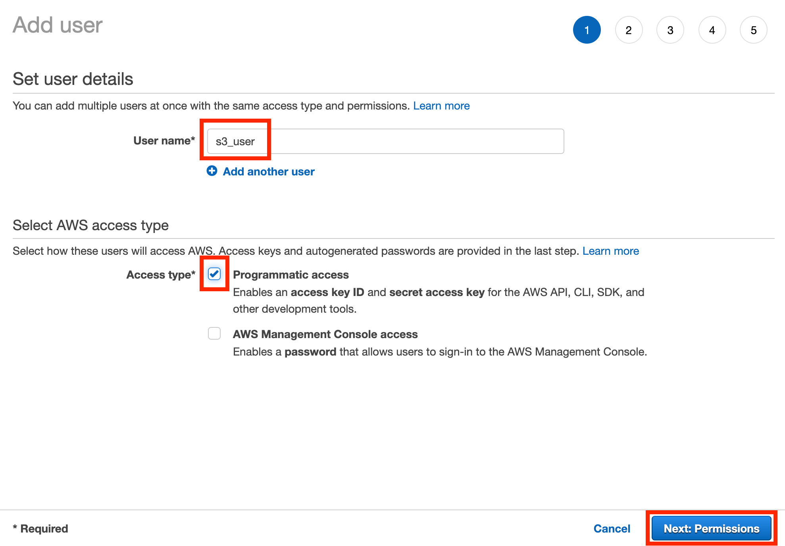
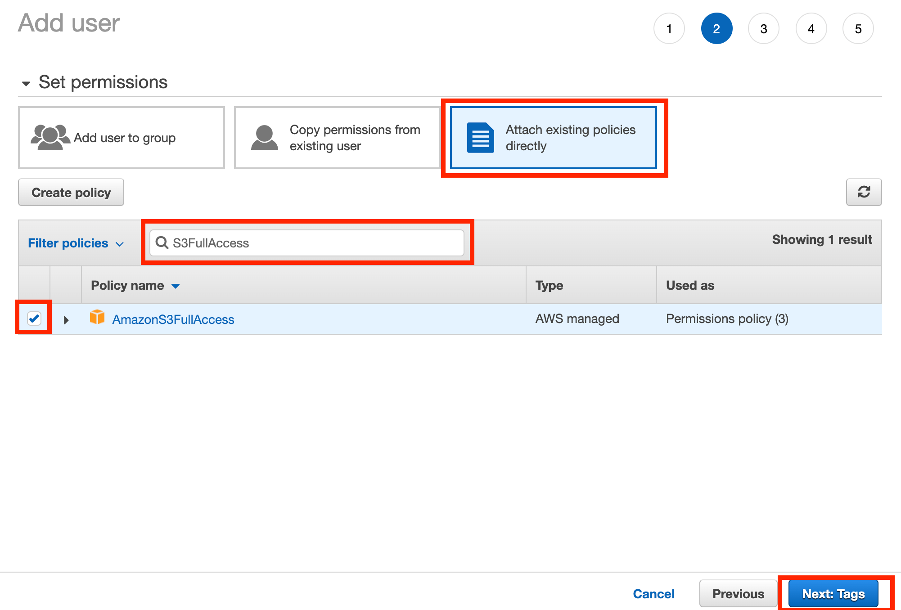
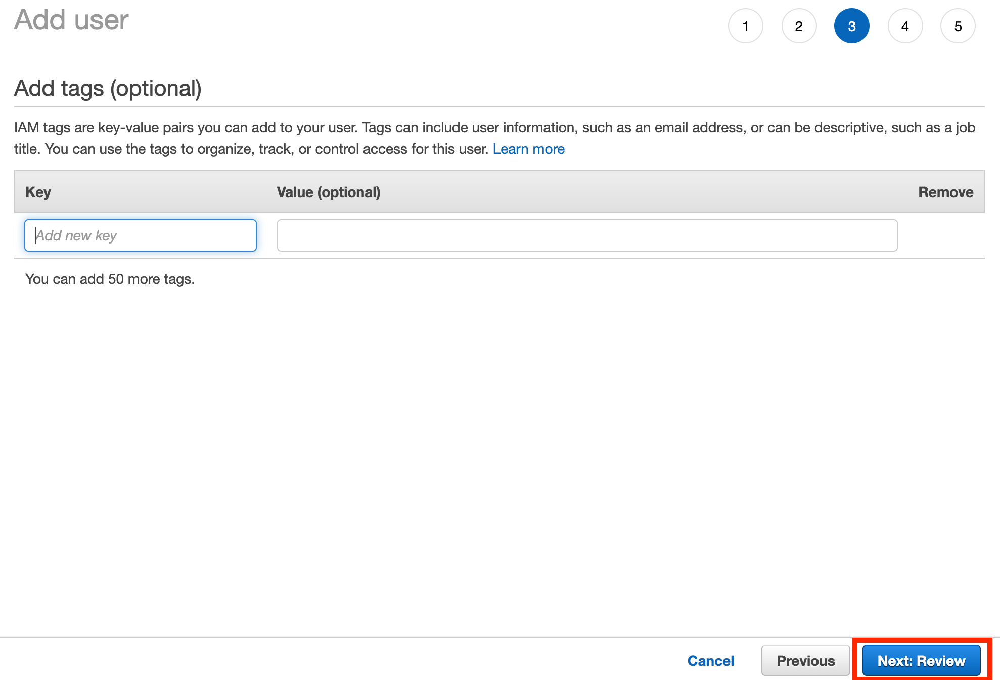
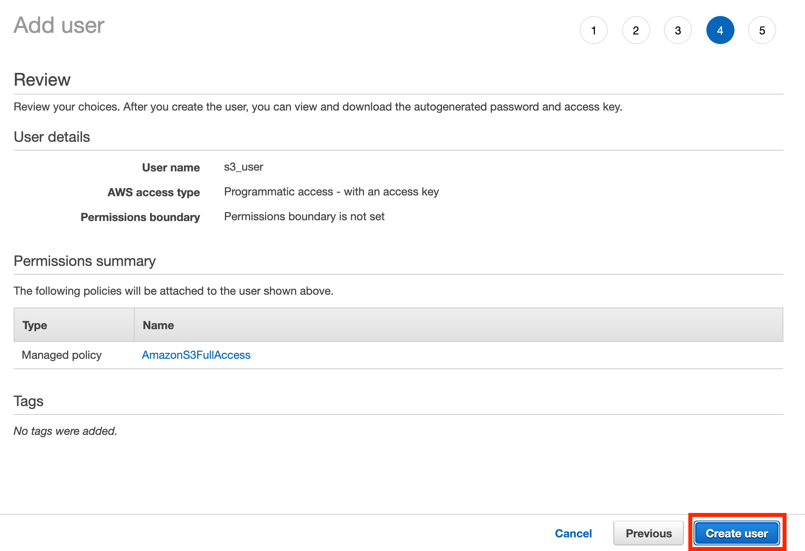
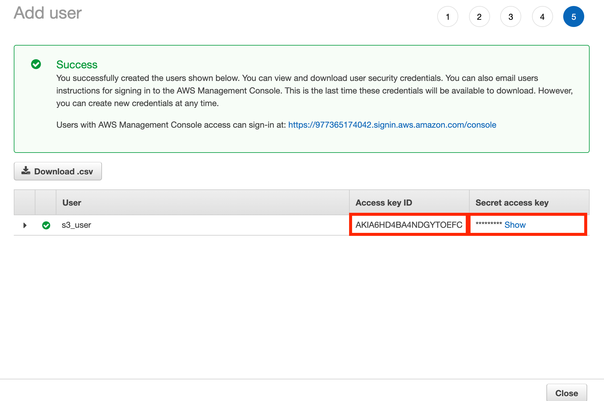
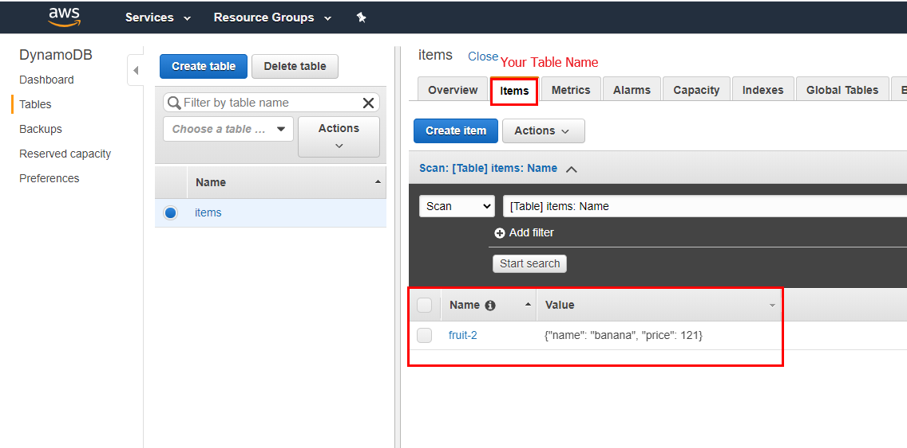

<p align="center">
  <a href="" rel="noopener">
 </a>
 <br>

</p>

<h3 align="center">Dynamo Dictionary</h3>

<div align="center">

[]()
[](https://github.com/da-huin/dynamo_dictionary/issues)
[](https://github.com/da-huin/dynamo_dictionary/pulls)
[](/LICENSE)

</div>

---

<p align="center"> Easily Use DynamoDB as a key-value format.
    <br> 
</p>

## 📝 Table of Contents

- [About](#about)
- [Getting Started](#getting_started)
- [Usage](#usage)
- [Acknowledgments](#acknowledgement)

## 🧐 About <a name = "about"></a>

Easily Use DynamoDB as a key-value format. You can use following functions.

* [Put](#put)
* [Get](#get)
* [Get All](#get_all)
* [Delete](#delete)

## 🏁 Getting Started <a name = "getting_started"></a>

### Installing

```
pip install dynamo_dictionary
```

<a name="prerequisites"></a>

### Prerequisites 

#### 1. Access Key required for DynamoDB Authentication. If you don't have Access Key, Please follow below steps.

1. Click below URL.

    https://console.aws.amazon.com/iam/home#/users

2. Click `Add user` button.

    

3. Input `User name` and enable `Programmatic access`.

    

4. Click `Attach existing policies directly` and Search `S3FullAccess` and check `AmazonS3FullAccess` and click `Next:Tags`.

    

5. Click `Next:Review`

    

6. click `Create user`
    

7. copy `Access Key ID` and `Secret access Key` to user notepad.

    

8. complete!

#### 3. You need to know which region your dynamodb table is in. If you don't know yet, Please refer to URL below.

https://docs.aws.amazon.com/ko_kr/AWSEC2/latest/UserGuide/using-regions-availability-zones.html

#### 3. (Required) Create Handler

Use this code to create handler.

```python
import dynamo_dictionary

table_name = "Your Table Name"
region_name = "Your Region Name"

# You don't need to use these two parameters if your authentication file is in ~/.aws/config.
aws_access_key_id = "YOUR AWS ACCESS KEY ID"
aws_secret_access_key = "YOUR AWS SECRET ACCESS KEY"

handler = dynamo_dictionary.DynamoDictionary(table_name, region_name,
                    aws_access_key_id=aws_access_key_id,
                    aws_secret_access_key=aws_secret_access_key)

print(handler)
```

result:
```
waiting for create table. . .
<dynamo_dictionary.DynamoDictionary object at 0x0136E448>
```

## 🎈 Usage <a name="usage"></a>

Please check [Prerequisites](#prerequisites) before starting `Usage`.

### 🌱 Put <a name="put"></a>

Use this function to save data into DynamoDB Table. 

**Examples**

```python
>>> print(handler.put("fruit", {"name": "apple", "price": 120}))

{'ResponseMetadata': {'RequestId': 'KS5A9R2ONP5BVK1SK7EH98B89VVV4KQNSO5AEMVJF66Q9ASUAAJG', 'HTTPStatusCode': 200, 'HTTPHeaders': {'server': 'Server', 'date': 'Thu, 06 Aug 2020 17:42:30 GMT', 'content-type': 'application/x-amz-json-1.0', 'content-length': '2', 'connection': 'keep-alive', 'x-amzn-requestid': 'KS5A9R2ONP5BVK1SK7EH98B89VVV4KQNSO5AEMVJF66Q9ASUAAJG', 'x-amz-crc32': '2745614147'}, 'RetryAttempts': 0}}
```

* If you want check data, check your dynamodb table in [DynamoDB Console](https://ap-northeast-2.console.aws.amazon.com/dynamodb/home?#tables:).



**Parameters**

* `(required) key`: str

    ```
    fruit
    ```

* `(required) value`: dict | list | str | bytes | int | float | ...

    ```python
    {"name": "apple", "price": 120}
    ```

**Returns**

* DynamoDB put result : `dict`

### 🌱 Get <a name="get"></a>

Use this function to get data from DynamoDB Table. 

**Examples**

```python
>>> print(handler.get(["fruit"]))
{'fruit': {'name': 'apple', 'price': 120}}

>>> print(handler.get("fruit"))
{'fruit': {'name': 'apple', 'price': 120}}
```

**Parameters**

* `(required) keys`: list | str

    * list of key or key

**Returns**

* Get result : `dict`

### 🌱 Get All <a name="get_all"></a>

Use this function to get all data from DynamoDB Table. 

**Examples**

```python
>>> print(handler.get_all())
{'fruit': {'name': 'apple', 'price': 120}, 'fruit-2': {'name': 'banana', 'price': 121}}
```

**Parameters**

**Returns**

* all data of the table  : `dict`

### 🌱 Delete <a name="get"></a>

Use this function to delete data from DynamoDB Table. 

**Examples**

```python
>>> print(handler.delete(["fruit"]))
...
>>> print(handler.delete("fruit"))
...
```

**Parameters**

* `(required) keys`: list | str

    * list of key or key

**Returns**

* dynamoDB delete result list : `list`

## 🎉 Acknowledgements <a name = "acknowledgement"></a>

- Title icon made by [Freepik](https://www.flaticon.com/kr/authors/freepik).

- If you have a problem. please make [issue](https://github.com/da-huin/dynamo_dictionary/issues).

- Please help develop this project 😀

- Thanks for reading 😄
